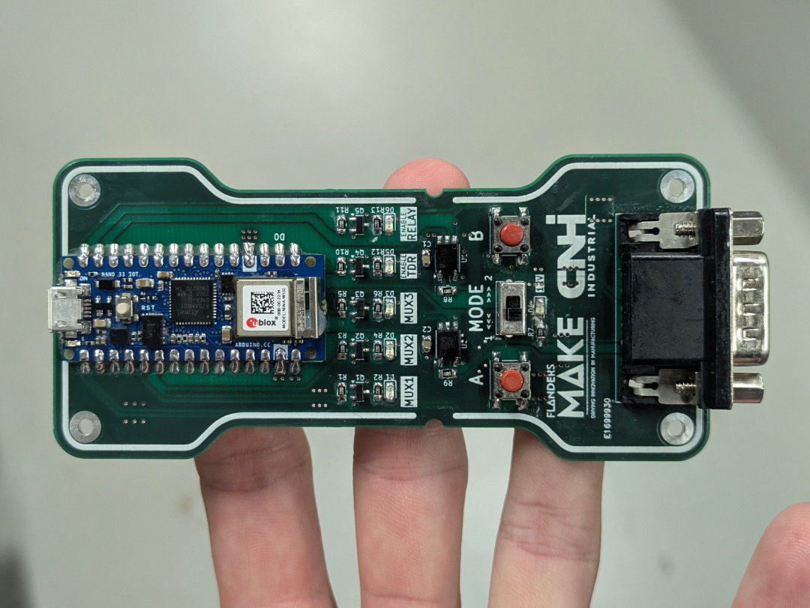

| {:.ioda} | {:.ioda} |
| :------------------------------------------------: | :------------------------------------------------: |
| {:.ioda} | {:.ioda} |
| {:.ioda} | {:.ioda} |
| {:.ioda} | {:.ioda} |
| {:.ioda} | {:.ioda} |
| {:.ioda} | {:.ioda} |
| {:.ioda} | {:.ioda} |
| {:.ioda} | {:.ioda} |

